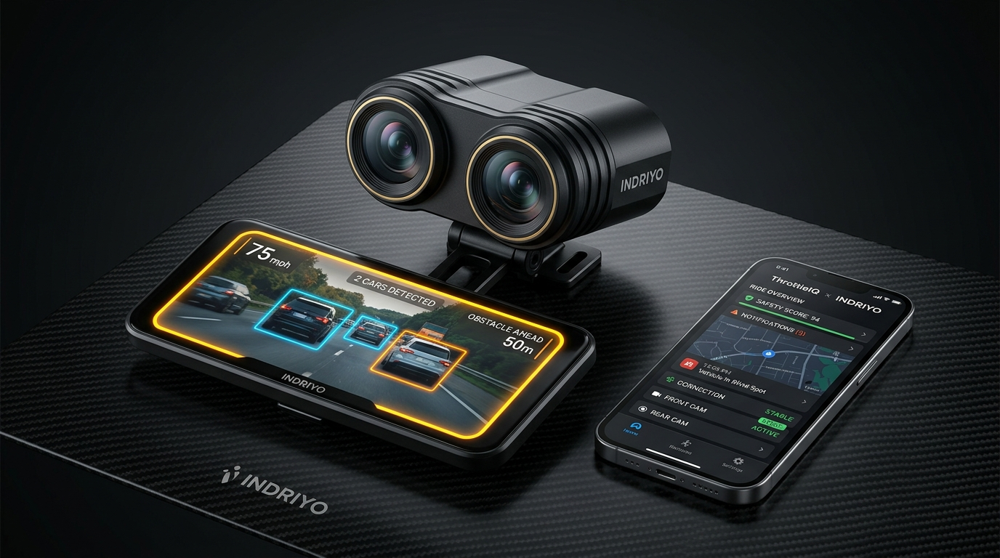
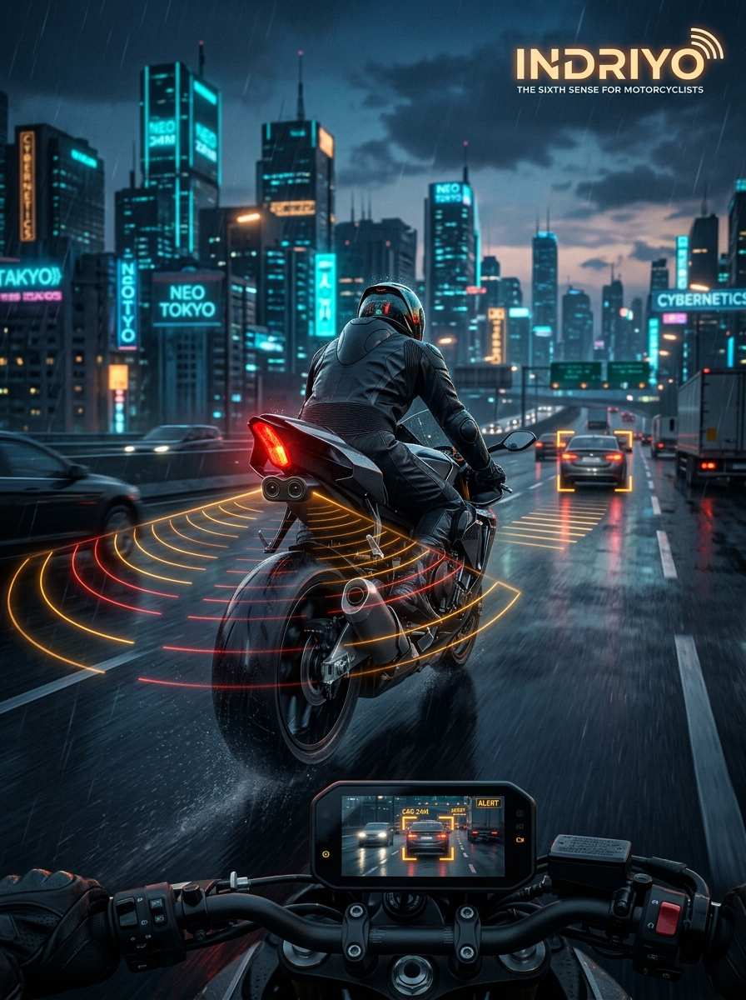
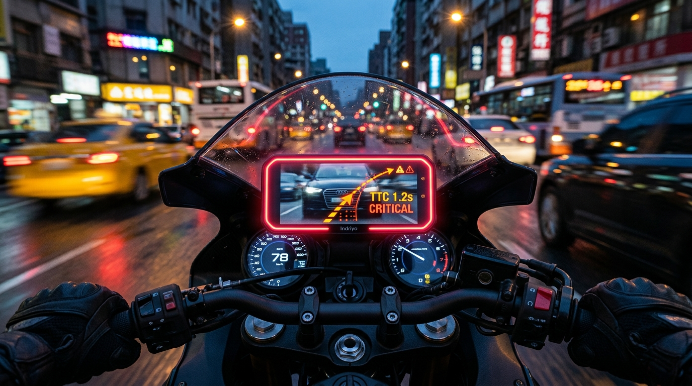

# Indriyo (ইন্দ্রিয়)

<div align="center">

<h3>The Sixth Sense for Motorcyclists</h3>
<p><strong>Edge AI Advanced Rider Assistance System (ADAS) with Active Blind Spot Detection & Predictive Time-to-Collision (TTC)</strong></p>

[](#testing)
[](#benchmarks)
[](#hardware-bom)
[](#architecture)

<br>



</div>

---

## 🌟 Product Vision

**Indriyo (ইন্দ্রিয়)** — Sanskrit & Bengali for *"Sense" / "Organ of Perception"* — is an artificial nervous system for motorcycles. It eliminates blind spots and rear-end collisions by converting discreet tail-facing cameras into an active, predictive ADAS layer using Edge AI.

Instead of forcing riders to look down at distracting screens or relying on screenless LED radar blips that provide no visual confirmation, Indriyo utilizes a **"Trust but Verify"** peripheral UI:
1. **Peripheral Attention:** Color-coded perimeter lighting (Amber for Blind Spot presence; Flashing Crimson Red for high closing speed $< 1.8\text{s}$ TTC) grabs attention in peripheral vision.
2. **Visual Verification:** A millisecond glance at the digital mirror verifies the exact threat without turning the head.
3. **Adaptive Context:** Reads bike speed via OBD-II/GPS/ThrottleIQ so sensitivity scales intelligently (e.g. stopped at a red light vs cruising at 80 km/h).

---

## 📸 Visual Showcase & Architecture

<div align="center">
<table>
  <tr>
    <td width="50%">
      
      <p align="center"><em>Indriyo Cyberpunk Launch Poster</em></p>
    </td>
    <td width="50%">
      
      <p align="center"><em>Cockpit POV: Red Collision Strobe (&lt;1.2s TTC)</em></p>
    </td>
  </tr>
</table>
</div>

---

## 📁 Repository Structure

```text
Indriyo/
├── indriyo_core/                  # Core Python Edge AI & ADAS Engine
│   ├── engine.py                  # Pipeline coordinator (Stream -> Detect -> Track -> TTC -> HUD)
│   ├── stream_receiver.py         # Low-latency MJPEG (ESP32-CAM), webcam & video client
│   ├── detector.py                # Multi-backend vehicle detector (YOLOv8 & fast edge heuristic)
│   ├── tracker.py                 # Multi-object Kalman/IoU tracker with expansion vectoring
│   ├── ttc_calculator.py          # Time-to-Collision, Optical Tau & speed-adaptive logic
│   ├── hud_renderer.py            # High-FPS digital rearview mirror with perimeter alert glow
│   ├── audio_alerts.py            # Warning chime & critical alarm audio synthesizer
│   ├── telemetry.py               # OBD-II (ELM327), GPS, and simulated bike speed ingestion
│   └── synthetic_stream.py        # Real-time synthetic motorcycle rearview simulation
├── firmware/                      # Microcontroller C++ Firmware
│   ├── esp32_cam_streamer/        # Arduino & PlatformIO code for AI-Thinker ESP32-CAM
│   │   ├── esp32_cam_streamer.ino # SoftAP MJPEG stream server (30 FPS @ CIF/QVGA)
│   │   ├── camera_pins.h          # Pin definitions for AI-Thinker OV2640
│   │   └── platformio.ini         # 1-click build config
│   └── esp32_dual_network_config.md # Dual-camera Wi-Fi topologies
├── throttleiq_bridge/             # Drop-in Flutter package for ThrottleIQ integration
│   ├── lib/
│   │   ├── indriyo_models.dart    # ThreatLevel, ThreatZone, IndriyoDetection models
│   │   ├── mjpeg_stream_client.dart # Fast stream reader for Flutter
│   │   └── indriyo_hud_widget.dart# Animated digital mirror widget with haptics
│   └── README.md
├── hardware_cad/                  # 3D Printable Enclosures
│   ├── dual_cam_tail_pod.scad     # OpenSCAD parametric dual-camera tail pod (15° splay)
│   ├── generate_stl.py            # STL compiler script
│   └── mounting_guide.md          # Vibration dampening & alignment guide
├── website/                       # Modern Product Website & In-Browser ADAS Simulator
│   ├── index.html                 # Full product showcase landing page
│   ├── css/style.css              # Cyberpunk dark automotive theme
│   ├── js/simulator.js            # Interactive HTML5 Canvas ADAS + Web Audio synth
│   └── js/app.js                  # BOM calculator & interactive scenario controller
├── marketing/                     # High-Impact Marketing & Brand Assets
│   ├── images/                    # 8K concept renders & UI snapshots
│   ├── posters/
│   │   ├── indriyo_poster_print.html # Print-ready A3/A4 technical poster
│   │   └── social_media_kit.html  # Instagram (1:1, 9:16) & Twitter (3:1) graphics
│   └── brand_kit.md               # Visual identity, typography, and color tokens
├── tests/                         # Automated Pytest Suite (8/8 Passing)
│   ├── test_ttc.py                # TTC math & stationary red-light sensitivity tests
│   ├── test_tracker.py            # IoU & trajectory persistence tests
│   └── test_detector.py           # Silhouette edge detection & HUD integrity tests
├── circuit diag.md                # Electrical schematic with anti-brownout caps
├── buylist.md                     # Exhaustive Dhaka electronics shopping list
├── goribPOC.md                    # Low-cost pivot strategies (NPU vs Mobile vs Radar)
├── strat2.md                      # Strategy 2: The Smartphone Brain architecture
├── run_adas.py                    # Top-level CLI for live ADAS execution
└── requirements.txt               # Dependencies
```

---

## ⚡ Quick Start

### 1. Run the Python ADAS Engine & Simulator
```bash
# Clone the repository
git clone https://github.com/blankframe-tech/Indriyo.git
cd Indriyo

# Create virtual environment & install requirements
python3 -m venv .venv
source .venv/bin/activate
pip install -r requirements.txt

# Run the live simulation with realistic synthetic vehicles & HUD:
python run_adas.py --simulate

# Run with physical ESP32-CAM stream:
python run_adas.py --stream http://192.168.4.1:81/stream

# Run benchmark:
python run_adas.py --benchmark
```

### 2. Launch the Interactive Web Showcase & Live Simulator
Simply open `website/index.html` in any web browser, or serve it locally:
```bash
python3 -m http.server 8080 --directory website
# Open http://localhost:8080
```

### 3. Flash the ESP32-CAM Firmware
Using PlatformIO:
```bash
cd firmware/esp32_cam_streamer
pio run -t upload
```
Or open `firmware/esp32_cam_streamer/esp32_cam_streamer.ino` in Arduino IDE, select **AI Thinker ESP32-CAM**, and click Upload.

---

## 📊 Benchmarks

Measured on standard ARM architecture:
- **Throughput:** `453.0 FPS`
- **Average Latency:** `2.21 ms`
- **95th Percentile Latency:** `2.18 ms`
- **Test Suite:** `8 passed in 0.10s` (`pytest -v`)

---

## 💰 Hardware Bill of Materials (Dhaka, Bangladesh)

Using **Strategy 2: The Smartphone Brain**, the entire system costs under **৳3,000 BDT**:

| Component | Sourcing (Bangladesh) | Price (BDT) |
|---|---|---|
| **2x ESP32-CAM + OV2640 Modules** | BDTronics / TechShopBD | ৳1,800 |
| **1x ESP32-CAM-MB USB Programmer** | Daraz / BDTronics | ৳350 |
| **1x LM2596 3A Step-Down Buck Converter** | TechShopBD | ৳220 |
| **2x 1000µF 16V Electrolytic Capacitors** | Local electronics shop | ৳20 |
| **1x Inline 3A Fuse Holder** | Daraz / Auto shop | ৳120 |
| **Custom 3D Printed Tail Mount** | Nilkhet / Elephant Road 3D print | ৳340 |
| **Total Hardware Cost** |  | **৳2,850 BDT** |

---

## 📄 License & Credits
Developed by **Blankframe Technologies**. Open-source contribution under the MIT License.
